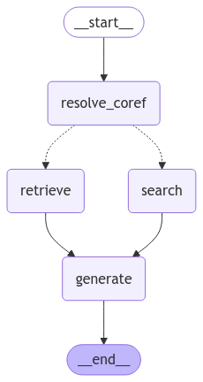

# RAG Mastering 

The main purpose of this project is mastering of a RAG technology and `LangChain/LangSmith/LangGraph` frameworks

## LangChain Solution

LangChain based solution allows to retrieve data from vector store and create an output based on this data. Agent is implemented as a chain with the help of 2 functions :
1. `create_stuff_documents_chain`, which creates chain for passing a list of documents to a model
2. `create_retrieval_chain`, which combines `retriever` and `stuff_document_chain` and creates chain, which retrieves documents and then passes them to a model

Then, this agent could be called with the help of `.invoke()` method.

## LangGraph Solution

LangGraph solution allows not only to retrieve data, but also search for relevant data on the Internet. Agent is implemented as a graph, which you can see on the image below:

Flow is next:
1. Query is recieved
2. Agent checks, does user want to retrieve data from vector store or search for relevant data on the internet
3. Agent receives data relevant data and passes it to the LLM
4. LLM generates output and returns it

>Note: Since __Ollama__ models were used in this project, and they do not support `tool_choice` selection, in order to avoid constant search calls, agent goes to the __search__ node only if query contains __*/search*__. Otherwise, it goes to the __retrieve__ node.